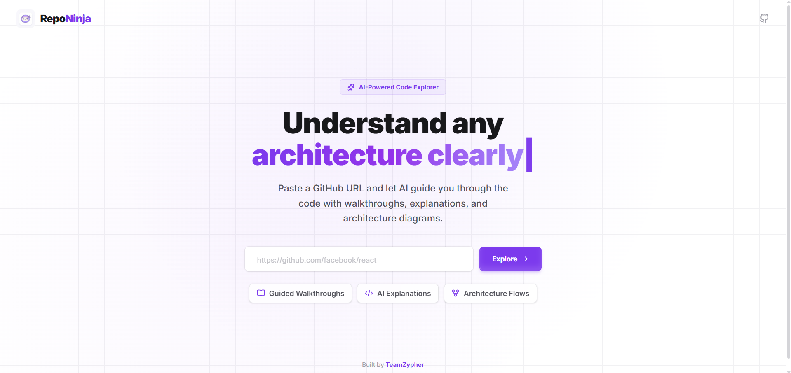
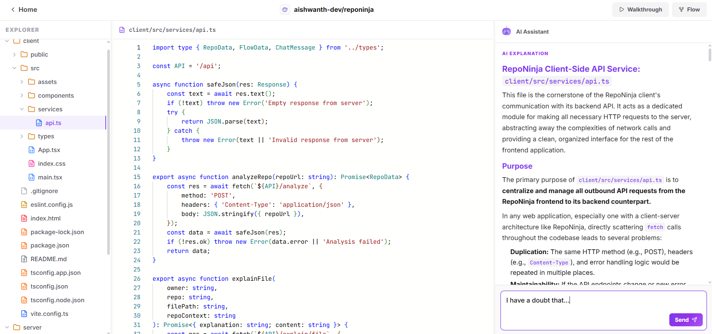
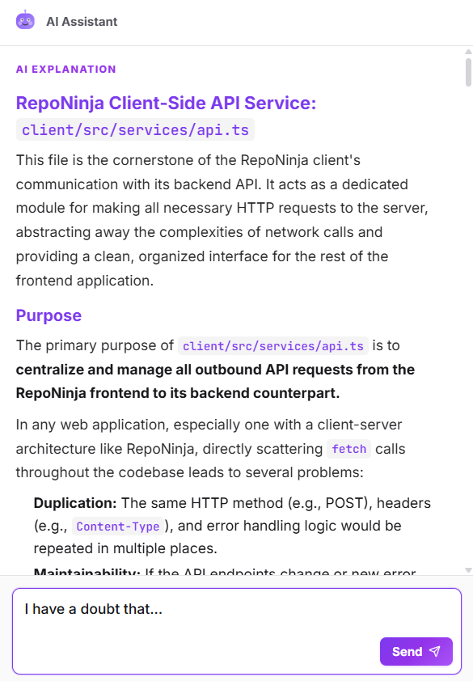
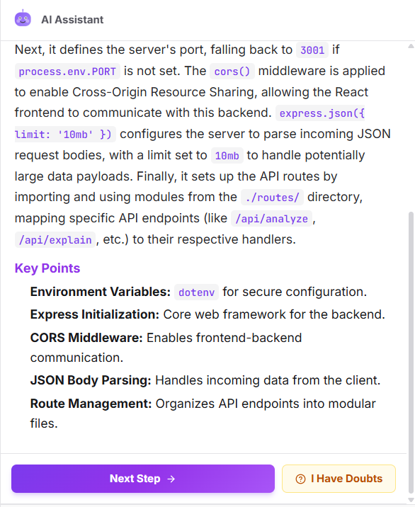
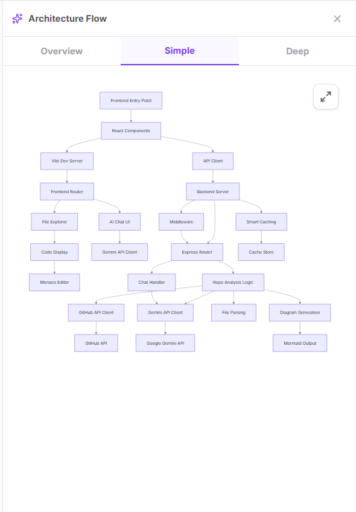

<p align="center">
  
  
  
</p>

# RepoNinja - Ai-For-Bharat Hackathon
-TeamZyhper

> ⚡ Understand any GitHub repository in seconds, not hours. Powered by Google Gemini AI.

RepoNinja is an AI-powered repository analysis tool that transforms the way developers explore and understand codebases. Paste any public GitHub repository URL, and RepoNinja instantly generates a comprehensive breakdown -- architecture diagrams, file-by-file explanations, guided walkthroughs, and an intelligent chat interface to ask questions about the code.

Built for the **AI for Bharat** hackathon, a nationwide initiative bringing together India's brightest developers to learn, innovate, and transform the country's AI landscape. 🇮🇳

---

## 🔍 The Problem

Onboarding onto a new codebase is one of the biggest time sinks in software development. Developers spend hours reading through unfamiliar files, tracing execution flows, and piecing together how components connect. Documentation is often outdated or missing entirely.

## 💡 The Solution

RepoNinja eliminates this friction. It connects to any public GitHub repository via the GitHub API, fetches the codebase, and uses Google Gemini to generate deep, contextual understanding of the entire project -- instantly.

---

## 📸 Screenshots

<p align="center">
  
</p>
<p align="center"><em>Landing Page -- Paste any GitHub URL and let AI do the rest</em></p>

<br />

<p align="center">
  
</p>
<p align="center"><em>Workspace -- File Explorer, Code Viewer, and AI Explanations side by side</em></p>

<br />

<p align="center">
  
  &nbsp;&nbsp;&nbsp;
  
</p>
<p align="center"><em>AI Explanations (left) &bull; Guided Walkthrough with "I Have Doubts" (right)</em></p>

<br />

<p align="center">
  
</p>
<p align="center"><em>Architecture Flow -- Interactive Mermaid diagrams with Overview, Simple, and Deep views</em></p>

---

## ✨ Features

### 📊 Repository Analysis
Automatically scans the repository structure, identifies key files, and generates a high-level summary covering the tech stack, architecture patterns, and project purpose.

### 📁 Interactive File Explorer
A full file tree with syntax-highlighted code viewing. Click any file or folder to get an AI-generated explanation of what it does and how it fits into the larger codebase.

### 🗺️ Architecture Flow Diagrams
Generates interactive Mermaid.js diagrams that visualize the project architecture -- showing how modules, services, and components connect and communicate.

### 🚶 Guided Walkthroughs
Step-by-step AI-generated walkthroughs that guide you through the codebase file by file, explaining the purpose, key logic, and relationships of each component.

### 💬 AI Chat
A context-aware chat interface where you can ask any question about the repository. The AI understands the full codebase context, so you get accurate, specific answers.

### ⚙️ Smart Caching
Previously analyzed repositories are cached locally, so revisiting a project loads instantly without re-fetching or re-analyzing.

---

## 🛠️ Tech Stack

| Layer      | Technology                                        |
|------------|---------------------------------------------------|
| Frontend   | React, TypeScript, Vite                           |
| Styling    | TailwindCSS v4, Framer Motion                     |
| Editor     | Monaco Editor (VS Code engine)                    |
| Diagrams   | Mermaid.js                                        |
| Backend    | Node.js, Express                                  |
| AI Engine  | Google Gemini API                                  |
| Data       | GitHub REST API                                    |

---

## 🚀 Getting Started

### Prerequisites

- Node.js (v18 or higher)
- A Google Gemini API key ([Get one here](https://aistudio.google.com/apikey))
- A GitHub Personal Access Token (optional, increases rate limits)

### Installation

1. **Clone the repository**

```bash
git clone https://github.com/aishwanth-dev/reponinja.git
cd reponinja
```

2. **Set up the backend**

```bash
cd server
npm install
cp .env.example .env
```

Edit the `.env` file and add your API keys:

```env
GEMINI_API_KEY=your_gemini_api_key
GITHUB_TOKEN=your_github_token
PORT=3001
```

3. **Set up the frontend**

```bash
cd ../client
npm install
```

4. **Run the application**

Start both the server and client in separate terminals:

```bash
# Terminal 1 -- Backend
cd server
npm run dev

# Terminal 2 -- Frontend
cd client
npm run dev
```

5. **Open in browser**

Navigate to `http://localhost:5173` and paste any GitHub repository URL to get started. 🎉

---

## 📂 Project Structure

```
reponinja/
├── client/                  # React frontend
│   └── src/
│       ├── components/
│       │   ├── HomePage.tsx         # Landing page with URL input
│       │   ├── AIPanel.tsx          # AI chat and analysis panel
│       │   ├── FileExplorer.tsx     # Repository file tree
│       │   ├── CodeViewer.tsx       # Syntax-highlighted code viewer
│       │   ├── MermaidDiagram.tsx   # Architecture flow renderer
│       │   ├── TopNavBar.tsx        # Navigation bar
│       │   ├── VanishInput.tsx      # Animated URL input
│       │   └── TextShimmer.tsx      # Shimmer text effect
│       ├── services/
│       │   └── api.ts               # API client
│       └── types/
│           └── index.ts             # TypeScript definitions
│
├── server/                  # Express backend
│   ├── routes/
│   │   ├── analyze.js       # Repository analysis endpoint
│   │   ├── explain.js       # File/folder explanation endpoint
│   │   ├── walkthrough.js   # Walkthrough generation endpoint
│   │   ├── flow.js          # Architecture diagram endpoint
│   │   └── chat.js          # AI chat endpoint
│   └── services/
│       ├── gemini.js        # Google Gemini AI integration
│       └── github.js        # GitHub API integration
│
└── README.md
```

---

## 📡 API Endpoints

| Method | Endpoint            | Description                              |
|--------|---------------------|------------------------------------------|
| POST   | `/api/analyze`      | Analyze a GitHub repository              |
| POST   | `/api/explain`      | Explain a specific file or folder        |
| POST   | `/api/walkthrough`  | Generate a guided codebase walkthrough   |
| POST   | `/api/flow`         | Generate architecture flow diagram       |
| POST   | `/api/chat`         | Chat with AI about the repository        |
| GET    | `/api/health`       | Server health check                      |

---

## 🧠 How It Works

```
GitHub URL --> GitHub API --> Fetch Repo Tree & Key Files
                                      |
                                      v
                             Google Gemini AI
                                      |
              ┌───────────────────────┼───────────────────────┐
              v                       v                       v
        Repo Summary          File Explanations        Architecture
        & Analysis            & Walkthroughs           Flow Diagrams
              |                       |                       |
              └───────────────────────┼───────────────────────┘
                                      v
                              React Frontend
                          (Interactive Dashboard)
```

---

## 👥 Team

**TeamZypher**

| Name              | Role      |
|-------------------|-----------|
| Aishwanth M S     | Developer |
| Govind DS         | Developer |
| Nithish           | Developer |
| Skandhan KS       | Developer |

---

## 🏆 Hackathon

**AI for Bharat** is a two-phase program designed to help developers in India turn AI theory into practice. Through curated workshops and challenges, participants learn key tools and gain hands-on experience building real-world AI applications.

This project was built as part of this nationwide movement to innovate and transform India's AI landscape.

---

## 📄 License

This project is open source and available under the [MIT License](LICENSE).
